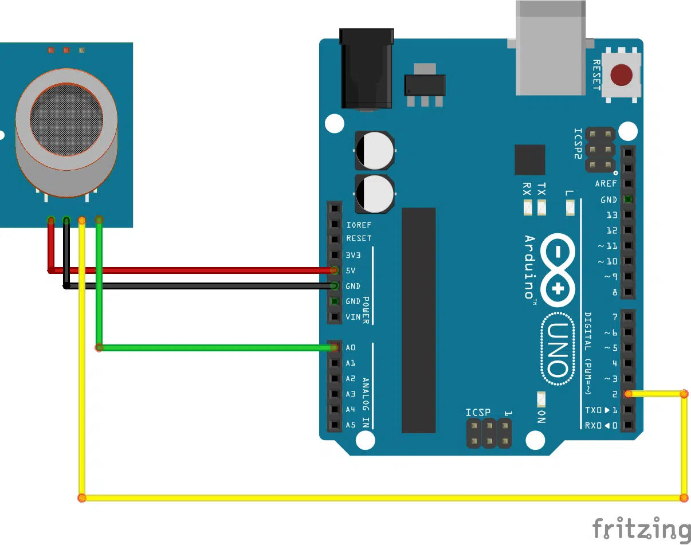

# Projeto: Medição de CO₂ (PPM) com MQ-135 no Arduino UNO usando PlatformIO

## 📌 Objetivo

Desenvolver um sistema para estimar a concentração de dióxido de carbono (CO₂) em partes por milhão (PPM) utilizando o sensor MQ-135 conectado a um Arduino UNO da Arduino, com desenvolvimento no PlatformIO.

## 🔧 Materiais Utilizados

- Arduino UNO
- Sensor MQ-135
- Jumpers

- PlatformIO (VSCode)

## 🔌 Circuito

<div style="text-align: center;">
  
</div>


## 🧠 Conceito de Funcionamento

O MQ-135 não mede CO₂ diretamente. Ele funciona variando sua resistência interna conforme a presença de gases no ambiente.

- Para estimar o valor em PPM, foi necessário:

- Ler o valor analógico do sensor

- Converter para tensão

- Calcular a resistência do sensor (RS)

- Determinar a razão RS/R0

- Aplicar equação logarítmica baseada no datasheet

## 📐 Fórmulas Utilizadas

### 1️⃣ Conversão para tensão

$$ V = leitura \times \frac{5.0}{1023.0} $$
	

### 2️⃣ Cálculo da resistência do sensor (RS)

$$ RS = \left(\frac{5.0}{V} - 1\right) \times RL $$

Onde:

RL = 10kΩ (resistor de carga do módulo)

### 3️⃣ Cálculo da razão

$$ ratio = \frac{RS}{R0} $$


### 4️⃣ Equação para estimar CO₂ em PPM

$$ CO_2 = 116.6020682 \times ratio^{-2.769034857} $$

Essa equação é uma aproximação baseada na curva do fabricante.

### 🧪 Processo de Calibração

- Para obter resultados mais confiáveis:

- Sensor ligado por aproximadamente 24 horas

- Colocado em ambiente externo (ar limpo)
 
- Medido valor de RS


### Fórmula de calibração
$$ R_0 = \frac{R_S}{3.6} $$

### Onde:
- **R₀** = Resistência do sensor em ar limpo (valor de calibração)
- **R_S** = Resistência atual do sensor medida durante calibração
- **3.6** = Fator de calibração para ar limpo (ratio esperado)

### Contexto importante:
Esta fórmula é utilizada **durante a calibração** do sensor MQ-135, onde:

1. O sensor é exposto ao **ar limpo** (ambiente sem gases poluentes)
2. Mede-se o valor de **R_S** neste ambiente
3. Considera-se que em ar limpo o **ratio = RS/R₀ = 3.6** (conforme datasheet)
4. Isola-se R₀ = RS/3.6

### Exemplo prático:
```cpp
// Durante calibração em ar limpo
float RS_medido = 100000; // 100kΩ
float R0 = RS_medido / 3.6; // ≈ 27.78kΩ

// Este R0 será usado para cálculos futuros
float ratio = RS_atual / R0;
```

O valor de 3.6 corresponde à relação típica RS/R0 em ar limpo segundo o datasheet.

### 📊 Valores Típicos de Referência
- Ambiente	CO₂ (PPM)
- Ar externo	~400 ppm
- Ambiente fechado	600 – 1000 ppm
- Qualidade ruim	2000+ ppm

### ⚠️ Limitações do Projeto

- Sensor sensível à temperatura e umidade

- Detecta múltiplos gases (não apenas CO₂)

- Valor em PPM é estimado, não absoluto

- Não substitui sensores NDIR profissionais
